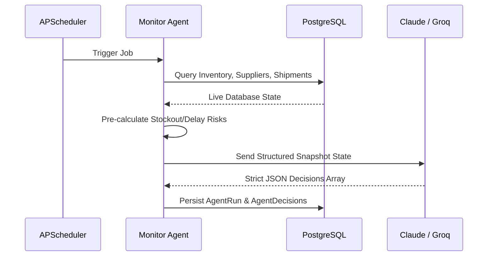

# SupplySense — System Architecture

SupplySense is a real-time, AI-driven supply chain risk monitoring and reactive investigation application. It is composed of a FastAPI backend, a PostgreSQL database, an autonomous scheduler agent, a reactive multi-turn tool agent, and a React dashboard interface.

---

## Architecture Design Diagram

```mermaid
graph TD
    subgraph Client Layer (React Dashboard)
        WebUI[React Vite App]
        Chat[Reactive Chat Input]
        Log[Agent Activity Log Panel]
    end

    subgraph Service Layer (FastAPI API)
        API[FastAPI Server]
        AuthAgent[Autonomous Monitor Agent]
        ReactAgent[Reactive Tool Agent]
        Scheduler[APScheduler Trigger]
    end

    subgraph Reasoning Core
        Risk[risk.py Pure Functions]
    end

    subgraph Data & Storage Layer
        DB[(PostgreSQL Database)]
        Alembic[Alembic Migrations]
    end

    subgraph External LLM APIs
        LLM[LLM API: Claude/Groq Llama]
    end

    %% Routing
    WebUI -->|Fetch Telemetry| API
    WebUI -->|Ask Question| API
    API -->|Route requests| ReactAgent
    Scheduler -->|Every 10 min| AuthAgent
    
    AuthAgent -->|1. Snapshot DB| DB
    AuthAgent -->|2. Check risk.py| Risk
    AuthAgent -->|3. Structured Prompt| LLM
    AuthAgent -->|4. Persist JSON Decisions| DB
    
    ReactAgent -->|1. Multi-turn loop <5| LLM
    ReactAgent -->|2. Execute Database Tools| DB
    ReactAgent -->|3. Synthesize & Respond| WebUI
    
    Log -->|Reads Runs & Decisions| DB
    Chat -->|Queries| ReactAgent
```

---

## The Two Coexisting Agents

### 1. Autonomous Monitor Agent

The Autonomous Monitor Agent runs on a background schedule powered by `APScheduler` (bootstrapped with the FastAPI app) and requires zero human intervention to scan the system.

**Execution Flow:**
1. **Database Snapshot:** The agent queries all active inventory, warehouse capacities, supplier details, and delayed shipping data.
2. **Pre-Calculation Layer:** Before sending the data to the LLM, the agent runs the pure functions in `backend/risk.py` (e.g., calculating stockout days and delivery delay impacts) and attaches this data to the snapshot. This reduces LLM hallucination and guarantees correct math.
3. **Optimized Payload:** Completed historical shipments and healthy inventory items are skipped to keep token counts compact (avoiding LLM context size and rate limits).
4. **Structured Reasoning Prompt:** The snapshot is passed to the LLM with a system prompt framing it as an Operations Analyst. The model must output a strict JSON list matching a database-ready schema.
5. **Database Persistence:** The results are parsed and saved into the `agent_runs` and `agent_decisions` tables. The React frontend reads this log directly to render the **Agent Activity Log** panel.



---

### 2. Reactive Tool-Use Agent

The Reactive Agent answers natural-language operations questions through a custom-coded multi-turn tool-use loop, without relying on LangChain or any external agent framework.

**Execution Flow (Max 5 Turns):**
1. **User Input:** The user submits a question through the chat box.
2. **Context Setup:** The agent defines standard tool schemas (describing function names, descriptions, and expected parameters).
3. **First Turn:** The agent sends the question, tool schemas, and history to the LLM.
4. **Tool Call Execution:** 
   - If the LLM generates a tool call, the hand-rolled loop intercepts the response, extracts the arguments, and runs the corresponding Python query handler in `backend/tools.py` against PostgreSQL.
   - The result of the query is appended as a `tool` role message in the conversation history, and a new turn is sent to the LLM.
5. **Final Output:** If the LLM does not call a tool, it indicates the terminal turn. The loop breaks and returns the text response alongside the complete step-by-step trace of thoughts and tool calls to display in the UI console.

```mermaid
sequenceDiagram
    participant UI as Chat Panel
    participant Loop as Hand-rolled Loop
    participant LLM as Claude / Groq
    participant Tools as backend/tools.py
    
    UI->>Loop: User Question
    loop Turn < 5 (Max)
        Loop->>LLM: Prompt + Tool Schemas + History
        alt LLM requests Tool Call
            LLM-->>Loop: Tool Call Name & Args
            Loop->>Tools: Execute Python Handler (Postgres)
            Tools-->>Loop: JSON Query Result
            Loop->>Loop: Append Result to History
        else LLM returns Text
            LLM-->>Loop: Terminal Answer Text
            Loop->>Loop: Break Loop
        end
    end
    Loop-->>UI: Final Answer + Complete Step Trace
```

---

## Database Schema (SQLAlchemy Models)

- **`warehouses`**: Tracks fulfillment hubs, locations, and capacity.
- **`suppliers`**: Tracks supply partners, category mapping, and composite risk levels.
- **`skus`**: Stores core product data, unit pricing, daily demand, safety stock, and lead times.
- **`shipments`**: Tracks active and historical logistics shipments, cost, and delivery delays.
- **`agent_runs`**: Records metadata for autonomous monitor checks and reactive agent conversations.
- **`agent_decisions`**: Stores structured alerts, reasoning details, and action plans generated by the monitor agent.
